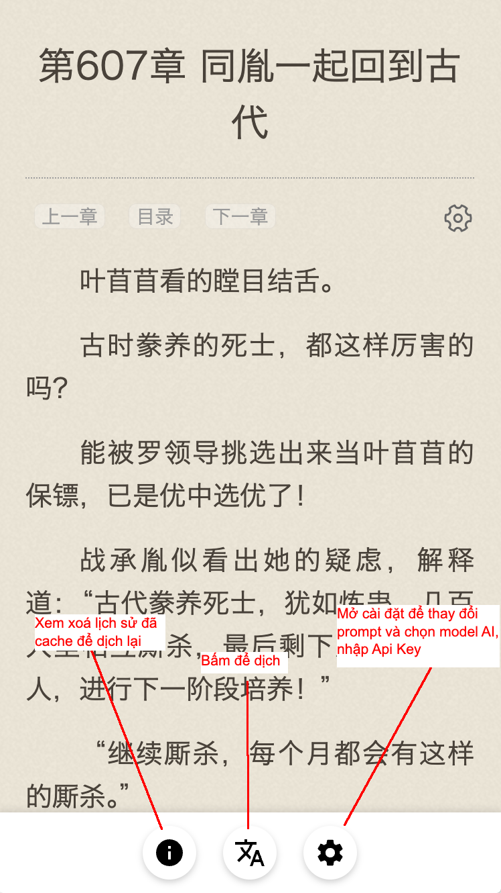
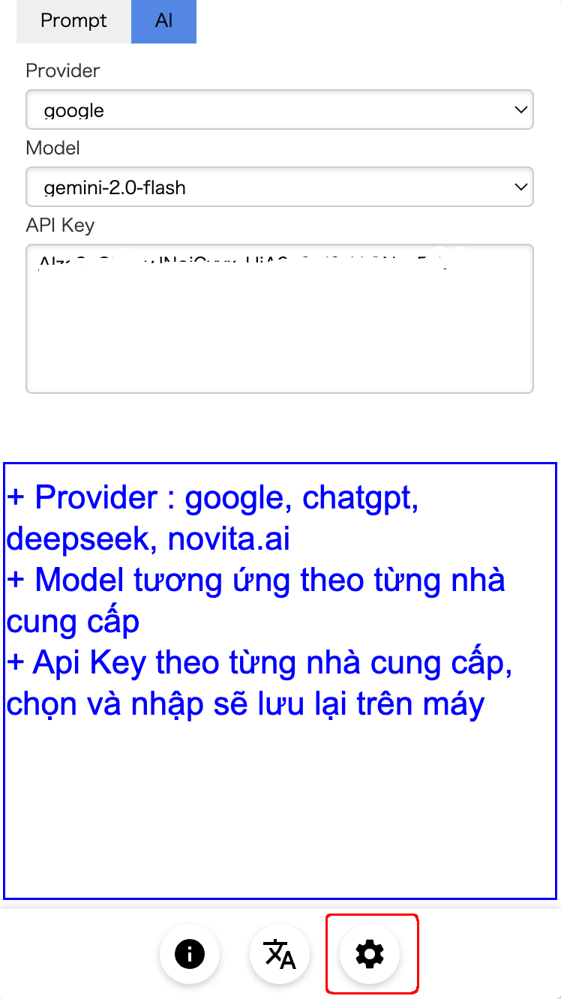
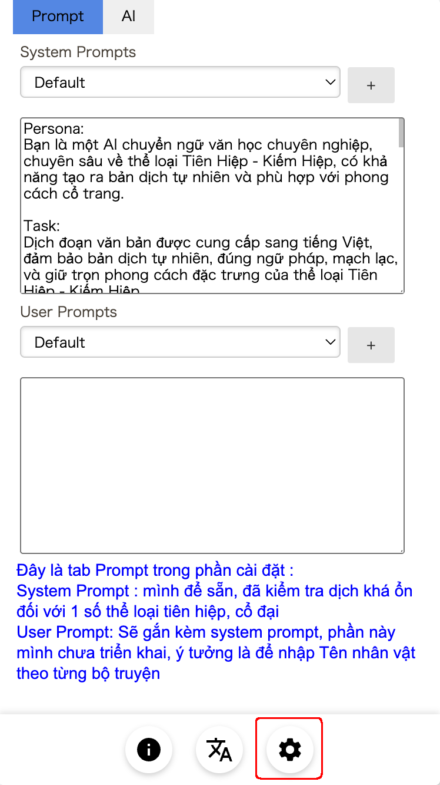

# Userscript Dịch Truyện AI - `dichtruyen.ai.vn.user.js`

Chào mừng bạn đến với userscript `dichtruyen.ai.vn.user.js`! Đây là một công cụ Tampermonkey giúp dịch truyện online từ tiếng nước ngoài sang tiếng Việt Nam bằng AI. Dưới đây là hướng dẫn chi tiết để cài đặt và sử dụng script trên các nền tảng: Windows, Linux, Android, macOS, iPad, và iPhone.

---

## Yêu cầu chung
- **Tampermonkey**: Hầu hết các nền tảng cần cài đặt extension Tampermonkey để chạy userscript. Riêng iPad/iPhone dùng Safari sẽ sử dụng ứng dụng thay thế là **Userscripts**.
- **File script**: Tải file `dichtruyen.ai.vn.user.js` từ repository này hoặc nguồn cung cấp của bạn.

---

## 1. Cài đặt trên Windows
### Bước 1: Cài đặt Tampermonkey
- Tải và cài đặt một trình duyệt hỗ trợ Tampermonkey:
  - **Google Chrome**: [Chrome Web Store - Tampermonkey](https://chrome.google.com/webstore/detail/tampermonkey/dhdgffkkebhmkfjojejmpbldmpobfkfo)
  - **Mozilla Firefox**: [Firefox Add-ons - Tampermonkey](https://addons.mozilla.org/en-US/firefox/addon/tampermonkey/)
  - **Microsoft Edge**: [Edge Add-ons - Tampermonkey](https://microsoftedge.microsoft.com/addons/detail/tampermonkey/iikmleipfamncoeapigifbpdccjbpkbc)
- Nhấn **"Add to Chrome/Firefox/Edge"** và làm theo hướng dẫn để cài đặt.

### Bước 2: Cài đặt dichtruyen.ai.vn.user.js
1. Mở trình duyệt đã cài Tampermonkey.
2. Kéo và thả file `dichtruyen.ai.vn.user.js` vào cửa sổ trình duyệt.
3. Tampermonkey sẽ hiển thị cửa sổ xác nhận. Nhấn **"Install"** để cài đặt script.
4. Mở một trang web đọc truyện online (theo `@match` trong script) để kiểm tra.

---

## 2. Cài đặt trên Linux
### Bước 1: Cài đặt Tampermonkey
- Tương tự Windows, cài Tampermonkey trên trình duyệt:
  - **Google Chrome**: [Chrome Web Store - Tampermonkey](https://chrome.google.com/webstore/detail/tampermonkey/dhdgffkkebhmkfjojejmpbldmpobfkfo)
  - **Mozilla Firefox**: [Firefox Add-ons - Tampermonkey](https://addons.mozilla.org/en-US/firefox/addon/tampermonkey/)
  - **Opera**: [Opera Add-ons - Tampermonkey](https://addons.opera.com/en/extensions/details/tampermonkey-beta/)
- Nhấn **"Add to Chrome/Firefox/Opera"** và cài đặt.

### Bước 2: Cài đặt dichtruyen.ai.vn.user.js
1. Mở trình duyệt đã cài Tampermonkey.
2. Kéo file `dichtruyen.ai.vn.user.js` vào trình duyệt hoặc nhấp vào biểu tượng Tampermonkey -> **"Add a new script"** -> dán nội dung file -> **Save**.
3. Nhấn **"Install"** khi được hỏi.
4. Truy cập trang web truyện để kiểm tra script.

---

## 3. Cài đặt trên Android
### Bước 1: Cài đặt Trình duyệt và Tampermonkey
- **Phương án 1: Firefox** (khuyến nghị):
  1. Tải **Firefox** từ [Google Play Store - Firefox](https://play.google.com/store/apps/details?id=org.mozilla.firefox).
  2. Mở Firefox, vào **Menu** (dấu ba chấm) -> **Add-ons** -> Tìm "Tampermonkey" và cài đặt.
- **Phương án 2: Chrome**:
  1. Tải **Chrome** từ [Google Play Store - Chrome](https://play.google.com/store/apps/details?id=com.android.chrome).
  2. Tải file `.crx` của Tampermonkey từ [Chrome Web Store](https://chrome.google.com/webstore/detail/tampermonkey/dhdgffkkebhmkfjojejmpbldmpobfkfo) bằng cách dùng công cụ tải extension (nếu Chrome không hỗ trợ trực tiếp).

### Bước 2: Cài đặt dichtruyen.ai.vn.user.js
1. Lưu file `dichtruyen.ai.vn.user.js` vào bộ nhớ thiết bị.
2. Mở trình duyệt, vào **Tampermonkey Dashboard** -> **Utilities** -> **Import from file** -> Chọn file `.user.js`.
3. Nhấn **"Install"** và kiểm tra trên trang web truyện.

---

## 4. Cài đặt trên macOS
### Bước 1: Cài đặt Tampermonkey
- Trên macOS, Tampermonkey hỗ trợ Safari, Chrome, Firefox:
  - **Safari**: Tải từ [Mac App Store - Tampermonkey Classic](https://apps.apple.com/us/app/tampermonkey-classic/id1482490089) (Yêu cầu macOS 10.14.4+).
  - **Chrome**: [Chrome Web Store - Tampermonkey](https://chrome.google.com/webstore/detail/tampermonkey/dhdgffkkebhmkfjojejmpbldmpobfkfo).
  - **Firefox**: [Firefox Add-ons - Tampermonkey](https://addons.mozilla.org/en-US/firefox/addon/tampermonkey/).
- Cài đặt bằng cách nhấn **"Add"** hoặc **"Get"**.

### Bước 2: Cài đặt dichtruyen.ai.vn.user.js
1. Mở trình duyệt đã cài Tampermonkey.
2. Kéo file `dichtruyen.ai.vn.user.js` vào trình duyệt.
3. Xác nhận **"Install"** trong cửa sổ Tampermonkey.
4. Kiểm tra script trên trang web truyện.

---

## 5. Cài đặt trên iPad/iPhone
### Bước 1: Cài đặt Userscripts (Safari)
- Trên iOS/iPadOS, Tampermonkey không hỗ trợ Safari trực tiếp. Dùng **Userscripts** thay thế:
  1. Tải **Userscripts** từ [App Store - Userscripts](https://apps.apple.com/us/app/userscripts/id1463298887) (Yêu cầu iOS 15.0+ hoặc iPadOS 15.0+).
  2. Mở ứng dụng Userscripts, chọn thư mục lưu script (ví dụ: iCloud Drive).
  3. Lưu file `dichtruyen.ai.vn.user.js` vào thư mục đó qua Files app.

### Bước 2: Kích hoạt và Cài đặt
1. Mở **Safari**, vào **Settings** -> **Extensions** -> Bật **Userscripts**.
2. Truy cập một trang web truyện, nhấn biểu tượng **"AA"** trên thanh địa chỉ -> **Userscripts** -> Chọn file `dichtruyen.ai.vn.user.js`.
3. Script sẽ tự động chạy khi khớp với `@match`.

### Lưu ý
- Nếu dùng iOS dưới 15.0, bạn có thể thử ứng dụng **Stay** ([App Store - Stay](https://apps.apple.com/us/app/stay-for-safari/id1596652956)) hoặc các trình duyệt thay thế như **Gear** (hỗ trợ userscript, nhưng có phí).

---

## Cách sử dụng
1. Vào 1 trang web bất kỳ sẽ hiển thị bottom bar như ảnh là thành công.

2. Bấm vào nút cài đặt(nút thứ 3 bên phải) sau đó vào tab AI để chọn model và cài đặt api key tương ứng, việc này chỉ cần làm 1 lần là chạy trên tất cả các trang web trừ khi bạn xoá data trình duyệt hoặc xoá userscript.

3. Hiện tại trong Cài đặt/Prompt chỉ chỉnh sửa system prompt và user prompt trực tiệp chưa cho tạo và chuyển qua lại giữa các prompt.

## Chọn model AI nào? 
- Hiện tại dịch nhanh, chất lượng tạm khá đối với các truyện ít nhân vật, bối cảnh vừa và miễn phí có gemini-flash-2.0 hoặc gemini-flash-1.5 của google cho người dùng cá nhân chạy khoảng 1500 lần/ngày.
- Ngoài ra deepseek cùng 1 prompt chất lượng hơn gemini chút xíu nhưng lại qúa chậm và mất phí (dù rất rẻ). Hiện có nhà cung cấp ([Novita.ai đang tặng mỗi tài khoản tại mới 20$](https://novita.ai/referral?invited_code=TV2UGE)), các bạn có gì ủng hộ ạ. Sau khi lấy được api key thì các bạn nhớ chọn Provider : novita.ai chứ không phải deepseek nhé.

## Góp ý và hỗ trợ
- Nếu gặp lỗi hoặc có ý kiến đóng góp, vui lòng tạo issue trên repository này hoặc liên hệ tác giả.
- Script được cập nhật thường xuyên để cải thiện hiệu suất dịch AI.

Chúc bạn đọc truyện vui vẻ với bản dịch tiếng Việt! 📖✨